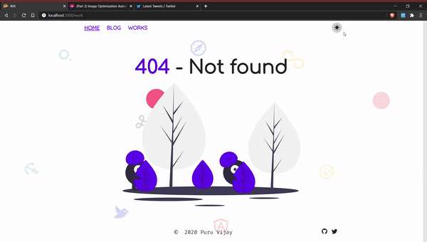
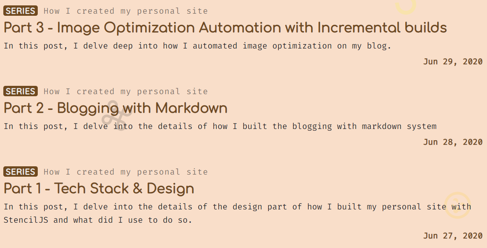
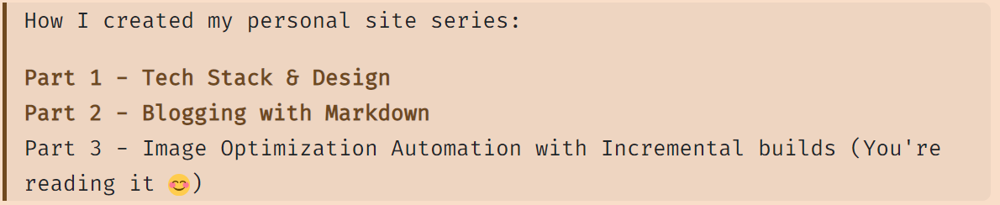

# ALERT!!!!
This is the old version of puruvj.dev. The current version is @ [PuruVJ/puruvjdev3](https://github.com/puruvj/puruvjdev3)

This is the complete source code for Puru Vijay's personal site/blog/portfolio [puruvj.dev](https://puruvj.dev).

# License

This project MIT License and you may use it as you deem fit.

# Stack

## Frontend packages

- Svelte
- Sapper
- [@mdi/js](https://www.npmjs.com/package/@mdi/js)
- [lazysizes](https://www.npmjs.com/package/lazysizes)
- [throttle-debounce](https://www.npmjs.com/package/throttle-debounce)

## Backend:

- Firebase Functions
- Firebase Firestore for storage

## Hosting;

Hosted on **Vercel**. Deployments happen with a simple `git push`

**Cloudflare** as caching and Analytics proxy.

# Features

📝 Blog posts stored as local `Markdown` files \
🤹‍♀️ Series blog posts supported \
🚀 Highly performant. JavaScript bundle < **28KB** Brotli \
📷 Image optimization

- [JPEG/PNG to WebP conversion, responsive images](https://puruvj.dev/blog/how-i-created-personal-site-part-3)

- [GIF to mp4](https://puruvj.dev/blog/gif-to-mp4-ffmpeg-fluent-web) for higher performance.

🎨 Theming - Light, Midday, Dark. Transitions between are animated. Uses CSS variables for this purpose



🎭 Different colored favicon for different themes\
🎏 Responsive. Adapts to screen size gracefully \
🚨 Uses different favicon for development \
😁 Converts emojis in the blog to Twitter emojis

# Getting Started

### 1. Clone

```bash
git clone https://github.com/puruvj/puruvjdev2.git YOUR_FOLDER_NAME
```

### 2. Install dependencies

```bash
cd YOUR_FOLDER_NAME
npm install

cd api
npm install
```

`api` folder has the backend logic(`Like` blog post functionality)

### 3. Delete blog posts and media

Cloning it will download blog posts, works and media that I have written and used. Delete those

- Delete posts inside `src/blog`
- Delete everything inside `static/media`, `static/works`

### Firebase Project

If you want to keep the `Like` button for your blog posts, you need to set up a firebase project.

Go to https://console.firebase.google.com, create your project.

Now download the private Service key for your project. [Instructions here](https://firebase.google.com/docs/admin/setup#initialize-sdk)

### Initialize Firestore

Go to the `Firestore` page in the console, initialize it(Choose Location)

You don't need to input anything. The serverless code will automatically figure out everything.

### Set up Vercel

I use Vercel for the ease of use and integration between frontend and backend it provides. All your functions are available in the `api` folder. Invoking them is as simple as requesting `/api/get-likes?blogID=ID`. No `Cors` issues.

You can set up another serverless service like AWS or firebase functions, but that will require a lot extra steps which I can't document here

#### Create environment variables

When you download the Service key from Firebase Console, copy the contents of the JSON file, and create an environment variable in [Vercel Environment Variable UI](https://vercel.com/blog/environment-variables-ui) named `FB_ADMIN_KEY` in both development and production and paste the contents of the admin key.

# Theming

All the theming information is stored in the `static/css/themes.css`. There are 3 themes. I recommend you to keep the 3 themes there(i.e., don't delete any of the themes defined), neither change the name of any.

```css
body.light {
  /* Themes */
}

body.midday {
  /* Themes */
}

body.dark {
  /* Themes */
}
```

If you change say `midday` theme name to `noon`, the whole theming system will break.

The CSS variables for every themes are as follows:

```css
body.theme {
  --app-color-primary: #6002ee;
  --app-color-primary-rgb: 96, 2, 238;
  --app-color-primary-shade: #4301a7;
  --app-color-primary-tint: #904ef3;
  --app-color-primary-contrast: #ffffff;

  --app-color-dark: #222428;
  --app-color-dark-rgb: 34, 34, 34;
  --app-color-dark-contrast: #ffffff;

  --app-color-light: #f4f5f8;
  --app-color-light-rgb: 244, 244, 244;
  --app-color-light-contrast: #000000;

  /* The background color of shell */
  --app-color-shell: white;
}
```

**Note**: To maintain consistency, the dark theme's `--app-color-dark` is actually a very light color(almost white). If you change these colors, make sure to invert the whole schema of colors.

## Favicons

The favicons also change with the themes. The favicons are stored as svg files and named in the format `favicon-{theme}.svg`. Replace those with appropriate ones or simply copy the same favicon and rename it for each theme if you don't wish this behavior

# Works

There's a `works.yaml` file in `src` folder where you can specify the works you wanna show off to the world.

It's structure is as follows

```yaml
title: Title of your work
url: The URl where people can see it(Website, Play Store)
stack: Comma separated list of stacks you used in it(e.g "svelte, sapper, html, css, js, nodejs")
description: The description of your project. Keep it short😄
repo: Optional
  url: The source url
  type: github(More options will be added)
image: Image file name. Image must be stored in the static/works folder
```

# Blog

Blog posts are written using Markdown. Metadata about every post is stored right in the markdown file itself.

The markdown file's name will be the URL the blog post is accessible (e.g `my-first-blog.md` -> `/blog/my-first-blog`)

## Metadata

Every blog post needs to have some YAML data at the top.

In your markdown file, enclose metadata like this

```yaml
---
title: Title of the blog Post
description: Description
date: 28 June, 2020 2:30 PM (Any date format valid for new Date() works, thought it is recommended to use the format above to remove confusion)
published: Whether to publish this blog post or not
cover_image: The location of image inside the static folder. For eg, if image is `static/media/image.jpg`, you pass the value `media/image.jpg`
series:
  The name of the series. Has to be same across the different blog posts that are in the series \
  Order is determined on the date they're published
---

```

## Emojis

You can directly input emojis from your OS's emoji keyboard, and they will be converted to the beautiful Twitter Emojis. Automatically. No config.

## Images

You can input images like

```md

```

Images should be inside `static` folder, preferably `media`. Remote images will throw an error.

Only JPG, PNG and GIF supported.

These will be optimized and converted to WebP. WebP version will be used wherever possible, and the original image will be used as a fallback

GIFs will be converted to MP4 for increased performance and smaller bundle sizes.

> Note: Due to issues with `markdown-it`, you can't use the `alt` text for now. It will be fixed in a later release. For now, the default `alt` text shown in the processed blog post is `Placeholder Image`.

## Series

If you are writing a series of blog posts, just type the name of the series in the metadata of the posts concerned:

```yaml
---
title: Title
description: Description
---
series: My First series
---

```

It will be shown on the `/blog` page like this:



The order of the blog posts are determined based on the `date` field, and numbered accordingly.

## Series linking

To automatically generate links of all the series, just put `{{ series-links }}` in your posts wherever you wish (Recommendation: Top and bottom).



Check it out on my blog here: https://puruvj.dev/blog/how-i-created-personal-site-part-3

> Note: The spaces in `{{ series-links }}` can't be changed. e.g `{{series-links}}` won't work at all.
