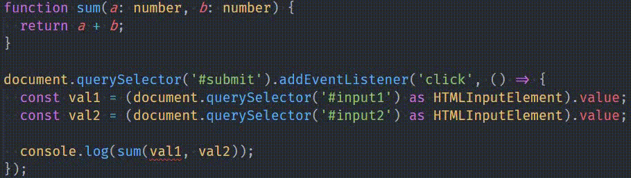
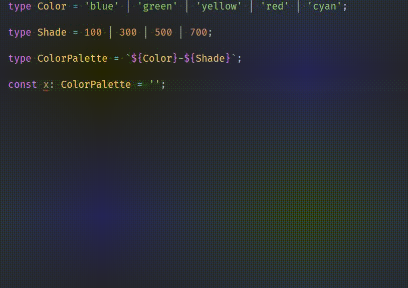

Alrighty! So, a fair warning before you jump on to the rest of the article: You probably won't learn any TypeScript related thing in this article. You may or you may not, I can't really say.

What I can say is that you are gonna enjoy the hell out of this article. Me being a huge fanboy about TypeScript might just make your day.

# Disclaimer

This isn't an extensive article about TypeScript or a Getting Started with TypeScript. This is just me fanboying about it and writing about the features I truly truly love of it.

I come from a JavaScript and PHP background, so I don't have any statically typed language experience from before like C, Java, or C++. Some things that I might find great or magical about TypeScript, might be super normal or even a bit irritating if you're coming from one of these classic typed languages. This article is just a huge opinion. Opinions differ. So I implore you to just ignore that part and move on.

# What is TypeScript?

In case you aren't familiar with TypeScript, it simply adds <mark>static type checking</mark> to your code, and that's what makes all the difference in the world.

Official Definition:

> TypeScript is a superset developed and maintained by Microsoft. It is a strict syntactical superset of JavaScript and adds optional static typing to the language. TypeScript is designed for the development of large applications and transcompiles to JavaScript.

```js
function sum(a, b) {
  return a + b;
}

document.querySelector('#submit').addEventListener('click', () => {
  const val1 = document.querySelector('#input1').value;
  const val2 = document.querySelector('#input2').value;

  console.log(sum(val1, val2));
});
```

Here we have a `sum` function declared, which will take two variables and return their sum. Then we have 2 inputs where you enter numbers. Then there's a submit button, which `onclick`, gets values of these 2 inputs and pass the input values to our `sum` functions, and `console.log` that value.

So let's consider this 👇


So when inputs are 2 and 8, their sum is 28. When values are 89, and 1, we get 891. Weird huh?

So here's what's happening. Instead of actually summing those numbers, javascript is actually concatenating those 2 numbers as if they are strings

```js
'2' + '8' = '28';
```

Well, this happens because `input.value` always returns a string, no matter if it is input `type="number"`.

It's easy to fix it. We just have to put a `+` sign in our values:

```js
const val1 = +document.querySelector('#input1').value;
```

This `+` will convert the incoming value from the input to number, if it can, otherwise it will turn it into `NaN`. Luckily in out case, it will convert those values to `2` and `8` as numbers, respectively, and we'll get the correct answer, `10`

This saved us in the end, but what if it was much more complex codebase, and a dev forgot to fix it, and shipped it to production? Ooh, whatever would happened, it would make headlines in HackerNews and Twitter 😂.

This where TypeScript comes in handy. Consider the above code's equivalent in TypeScript:

```ts
function sum(a: number, b: number) {
  return a + b;
}

document.querySelector('#submit').addEventListener('click', () => {
  const val1 = (document.querySelector('#input1') as HTMLInputElement).value;
  const val2 = (document.querySelector('#input2') as HTMLInputElement).value;

  console.log(sum(val1, val2));
});
```

We added the type `number` to out parameters in `sum` function, used `as` keyword to say that the element selected is actually an `input` element. But our code editor shows an error here.



See, Typescript is giving us an error that we can't put a `string` where a `number` was expected. It took the guessing game out of the equation completely, and saved us a lot of time later when the we would be looking in the whole codebase for the issue.

# Only specific values allowed

You can limit the values a variable can be, using <mark>String Literal Types</mark>:

```ts
const x: 'hello' | 'hi' | 'hola' | 'namaste' = 'hello';
```

You try to put any other value in `x`, TypeScript will throw an error, and just won't compile your code.

This feature helps a load, especially when I'm building error handling logic in React forms. I can simply make a map of all kinds of error codes and their messages, and limit it using TypeScript

```ts
type TLoginError =
  | 'user-not-found'
  | 'wrong-password'
  | 'network-request-failed'
  | 'too-many-requests';

const loginErrorMessages: { [error in TLoginError]: string } = {
  'network-request-failed': `Network request failed. Try to log in again.`,
  'user-not-found': 'Email not found in our database',
  'wrong-password': 'Email and Password do not match',
  'too-many-requests': 'Too many login attempts. Try again in a minute',
};
```

`loginErrorMessages` won't take a property other than those specified in the type `TLoginError`. I can't stress enough how important that feature was when I was building an app.

You can specifies numbers only too

```ts
type FontWeights = 100 | 200 | 300 | 400 | 500 | 600 | 700;
```

Not to mention their use in limiting Arrays to accept only a small set of values.

```ts
const searchFilters = ('name' | 'email' | 'phone' | 'designation')[] = [];
```

I actually used this snippet in a search feature I built for a Dashboard app.

## Template Literal Types 💪

Think of typings for Tailwind color palette.

Let's limit ourselves to just 5 main colors, and 4 shades for the next example.

```ts
type ColorPalette =
  // Blue
  | 'blue-100'
  | 'blue-300'
  | 'blue-500'
  | 'blue-700'

  // Green
  | 'green-100'
  | 'green-300'
  | 'green-500'
  | 'green-700'

  // Yellow
  | 'yellow-100'
  | 'yellow-300'
  | 'yellow-500'
  | 'yellow-700'

  // Red
  | 'red-100'
  | 'red-300'
  | 'red-500'
  | 'red-700'

  // Cyan
  | 'cyan-100'
  | 'cyan-300'
  | 'cyan-500'
  | 'cyan-700';
```

OMG!! We already had to declare `20` different color shade types here. And this is with a limited palette. Tailwind's actual palette has `22` colors, and `10` color shades. That's a whopping <mark>220</mark> string literals. We can't define all 220 of those can we?

But we can use this nifty new feature called `Template Literal Types`. This feature shipped in TypeScript `4.1.0`, and was a total game changer when it dropped. It allowed us to apply dynamic behavior in your literal types.

See 👇

```ts
type Color = 'blue' | 'green' | 'yellow' | 'red' | 'cyan';

type Shade = 100 | 300 | 500 | 700;

type ColorPalette = `${Color}-${Shade}`;
```

Now `ColorPalette` contains all the combinations that can come from crossing all these values from these 2 types. See for yourself 👇



This here is pure magic 🦄

# Tuples FTW!

> A tuple is a collection which is ordered and unchangeable.

Tuples in TypeScript are super amazing. They help a lot when working with Arrays. Consider this

```ts
type Coordinates = [number, number];

function getLocation(coords: Coordinates) {
  const [x, y] = coords;

  /** Logic */
}
```

Now coords can only be given values that are of <mark>number</mark> type, and only **2 values**. No less than 2, no more.

Another example:

```ts
type Grid = [[number, number], [number, number]];

const x: Grid = [
  [1, 2],
  [3, 4],
]; // ✅ Correct

const y: Grid = [[1, 2], 3]; // ❌ ERROR
```

Main use of Tuples is in limiting the **types**, as well as the number of items it can take.

And the types don't have to be same, you can mix and match these as much as you wish

```ts
type UserData = [string, number, number, string, UserRole];
```

So useful!

# It is futuristic

TypeScript is always ahead of JavaScript. Every feature that comes to JavaScript, already gets implemented into TypeScript months, even years before it first shows up in JavaScript the first time.

Generally, any feature proposal in <mark>ECMAScript</mark> that reaches Stage 3 or 4, it gets implemented into TypeScript. You can start using the feature directly, and TypeScript will just polyfill it to work in browsers.

For example, look at Optional chaining. I've been using it for over a year in TypeScript before it officially dropped in Chrome.

> Refresher: Optional chaining removes the need for checking for properties in an object before using them. `x && x.y && x.y.z && x.y.z()` simply becomes `x?.y?.z.()` using Optional Chaining.

Same was the case with Classes, ES6 Proxies, Spread operator, Destructing. You name it.

# Intersection save labour
