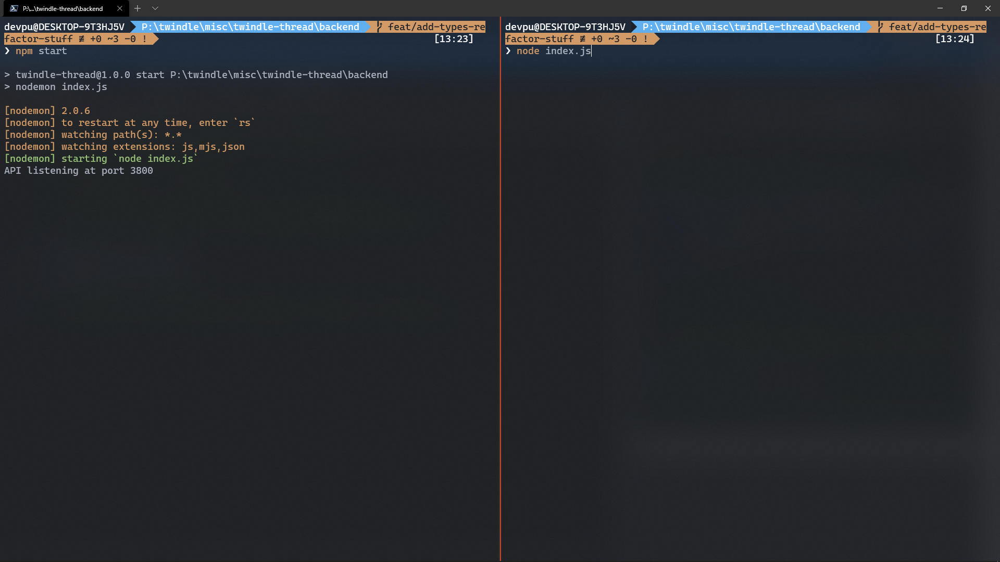
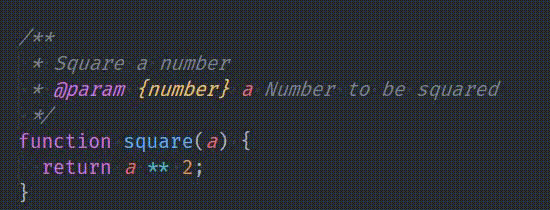

{{ series-links }}

Before starting, I wanna get this outta the way: If your reaction on reading the title was anywhere close to Hermione's 👇


Don't worry. I haven't gone crazy, and neither will you after reading this 😉

With that out of the way, let's begin.

Lemme break it down

# Best things about TypeScript

What are the best things about TypeScript. Some things that can be listed here:

- Static type Checking
- Seamless integration with <mark>VSCode</mark>
- Futuristic. Use any syntax that isn't even in JS and TS will convert it to something backwards-compatible.
- JS files can be converted to TS files seamlessly.
- Catches silly bugs in your code.
- Strict about code.

There can be more,

# Think again!

Are all of these really the best things about TypeScript? Sure these are all really good. But the problem that comes with them is the fact that you need an additional compile step. Also, you need tooling to watch your project as the files change. That adds a boatload of configuration, dependencies, and just more and more complexity.

# Duh, just use a boilerplate 🙄

Yeah, I got it dude/tte, I can use a boilerplate from npm that will set up the right config, and all I have to do is `npm start` for watching and `npm run build` for final bundle.

But it doesn't get rid of the added complexity that is the dependencies, watch step and build step.

For modern Web App development, it's all fine. You already have a dev server running. Throwing in a few more plugins won't make much difference. And tools like [Snowpack](https://www.snowpack.dev/) and [Vite](https://vitejs.dev/) completely get rid of complexities by collapsing layers(That is, they come with all the right **batteries included**, so you don't have to do any config work yourselves. If that piqued your interest, check out this amazing article by [Shawn "swyx" wang](https://twitter.com/swyx) about [Collapsing Layers](https://www.swyx.io/collapsing-layers/))

The problem comes when you're trying to build your own library to be published on npm. And by library here, I refer to a **non-UI library**(Not Component libraries, for example).

Why non-UI library? Because you aren't running any dev server on them by default. You have to test them everytime by reloading the page, or worse, again and again run `node index.js` if it's a NodeJS related library.

With libraries like these, if you include TypeScript in development process, there are some **heavy** drawbacks:

## Watch step

You have to keep a watcher running in one terminal, and use another one to test your code. You end up with a situation where you have 2 terminals open:



Split terminals. And good luck dealing with 2 terminal windows if your terminal doesn't split up.

## Build step

This one is probably worse than the watch step, for frontend libraries. In frontend, one of the most important thing is the bundle size you're sending to the user. The bundle size has to be kept as low as possible, so the site can load fast enough.

And this where one of TypeScript's best feature actually becomes a handicap: **TRANSPILING FOR OLDER BROWSERS**

Look at this 👇

```ts
const arr = [1, 2, 3, 4, 5];

const newArr = [...arr, 6, 7];
```

Looks simple enough. We're just trying to create a new array from an existing array and add some items to it using the <mark>Spread operator</mark>. But if your TSConfig's target is specified as less than `es2015`, you're gonna get a very weird result:

```js
'use strict';

var __spreadArrays =
  (this && this.__spreadArrays) ||
  function () {
    for (var s = 0, i = 0, il = arguments.length; i < il; i++) s += arguments[i].length;
    for (var r = Array(s), k = 0, i = 0; i < il; i++)
      for (var a = arguments[i], j = 0, jl = a.length; j < jl; j++, k++) r[k] = a[j];
    return r;
  };

var arr = [1, 2, 3, 4, 5];
var newArr = __spreadArrays(arr, [6, 7]);
```

Wohkay!! That's a tad too much. All we wanted to do was just concat an array with another. Effectively this 👇

```js
const arr = [1, 2, 3, 4, 5];

const newArr = arr.concat([6, 7]);
```

TypeScript injected a huge function for spreading purposes. Makes sense. Spread is meant to work on not just Arrays, but more structures, and has much more complexity than the simple concat function. It makes sense for TypeScript to do so.

If you're a library author, and targeting modern workflows, it doesn't make sense for all this polyfilling. The target workflow, if modern enough, would already have it's own polyfilling system, and your library sending off its own polyfills will only make things worse, due to polyfill duplication. And forget polyfilling, what if the final user is targeting modern browsers? You'll still be sending polyfills to it.

Similar is the case with using <mark>async/await</mark>:

Look at this code sample 👇

```ts
async function main() {
  const req = await fetch('url');
  const data = await req.json();

  console.log(data);
}
```

The main logic is just 2 lines. And when you compile it using TypeScript for targets before `es2017`, you get this ginormous result:

```js
'use strict';
var __awaiter =
  (this && this.__awaiter) ||
  function (thisArg, _arguments, P, generator) {
    function adopt(value) {
      return value instanceof P
        ? value
        : new P(function (resolve) {
            resolve(value);
          });
    }

    return new (P || (P = Promise))(function (resolve, reject) {
      function fulfilled(value) {
        try {
          step(generator.next(value));
        } catch (e) {
          reject(e);
        }
      }

      function rejected(value) {
        try {
          step(generator['throw'](value));
        } catch (e) {
          reject(e);
        }
      }
      function step(result) {
        result.done ? resolve(result.value) : adopt(result.value).then(fulfilled, rejected);
      }
      step((generator = generator.apply(thisArg, _arguments || [])).next());
    });
  };

function main() {
  return __awaiter(this, void 0, void 0, function* () {
    const req = yield fetch('url');
    const data = yield req.json();
    console.log(data);
  });
}
```

It creates this huge function to interop with [generators](https://developer.mozilla.org/en-US/docs/Web/JavaScript/Reference/Statements/function*). The function generated alone is <mark>1KB</mark>. 1KB mayn't be huge, but it makes all the difference for a library like Preact, which takes pride in it being only <mark>10kb</mark> minified.

This is a big problem.

> Again, this is not a problem when you're developing a Web App. It's a problem when it's a library that ships polyfills that are not needed by your project.

# Solution

What I'm gonna say will be quite radical. Stay with me for a while.

**DON'T WRITE CODE IN TYPESCRIPT FILES**

## WHAT?!?!?!

Yup. If you wanna drastically decrease the complexity in your tooling, don't write `.ts` files. **Instead use TypeScript inside your .JS files**

## You lost me there, mate!

There's a way to use TypeScript within JavaScript files. And the only tooling it requires is:

- VSCode as the editor
- ESLint extension for VSCode

That's it. And there's a very high probability that you, the reader have both of these already installed, if you're reading this blog post.

# Using TypeScript in JavaScript files

VSCode has JSDoc built right into it.

> JSDoc is a way to document your code right in there, in comments. It was initially created to generate these huge documentation sites, but later VSCode adopted it for use in intellisense.

You can get same level of intellisense by using JSDoc as you get in directly using TypeScript

## Refresher on JSDoc

You write JSDoc like this:

```js
/**
 * Square a number
 * @param {number} a Number to be squared
 */
function square(a) {
  return a ** 2;
}
```

JSDoc starts with a double star(`/**`), not `/*`. VSCode will only recognize the comments as JSDoc if there are 2 stars.

On next line, we are describing what the function does. It's a simple description.

On the next line, `@param {number} a Number to be squared` is used to specify that the function parameter `a` is of type `number`. The text `Number to be squared` is just a description of this parameter.

Let's see it in action 👇



VSCode inferred parameter and function return type from JSDoc itself.

```ts
function square(a: number): number;
```

And you get this additional description whenever you use this function.

If you wanna type a variables rather than a parameter, that's possible too.

```js
/** @type {string} */
const name = 'Hello';
```

## Let's convert a TS program to JS

So let's take a look at this small TypeScript program. This is the same one I used in the predecessor of this blog post, [An Ode ❤ to TypeScript](https://puruvj.dev/blog/get-to-know-typescript-an-ode-to-typescript)

```ts
function sum(a: number, b: number) {
  return a + b;
}

document.querySelector('#submit').addEventListener('click', () => {
  const val1 = +(document.querySelector('#input1') as HTMLInputElement).value;
  const val2 = +(document.querySelector('#input2') as HTMLInputElement).value;

  console.log(sum(val1, val2));
});
```

So let's convert it step by step into its JSDoc equivalent.

### sum function

First function we encounter here is

{{ series-links }}
